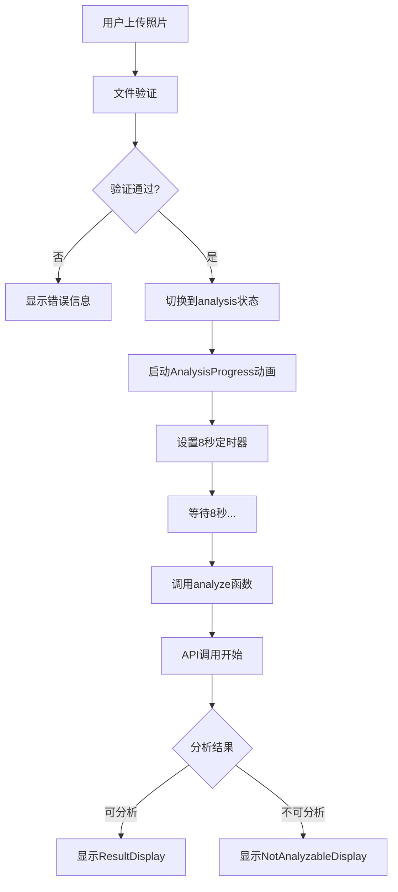
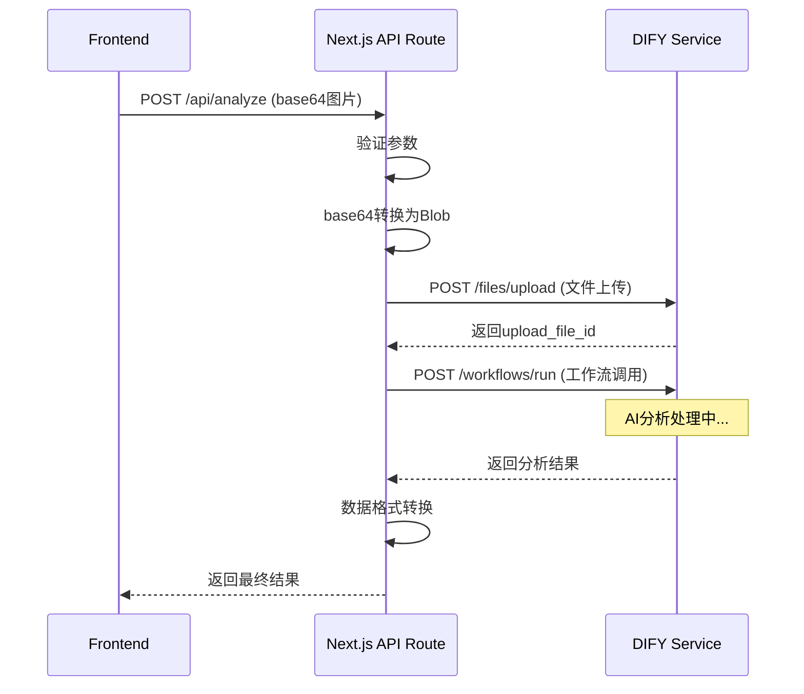

# 人脸分析功能工作流调用时机分析文档

## 1. 当前调用时机分析

### 1.1 用户上传照片后的完整流程时间线

```mermaid
gantt
    title 人脸分析完整流程时间线
    dateFormat X
    axisFormat %s
    
    section 前端动画
    人脸检测 (800ms)     :active, step1, 0, 800
    特征分析 (1000ms)    :active, step2, 800, 1800
    美学评分 (800ms)     :active, step3, 1800, 2600
    报告生成 (400ms)     :active, step4, 2600, 3000
    等待时间 (5000ms)    :crit, wait, 3000, 8000
    
    section API调用
    文件上传到DIFY       :api1, 8000, 9000
    工作流执行          :api2, 9000, 12000
    结果返回           :api3, 12000, 12500
```



**关键时间节点：**
- **0-3秒**：前端动画播放（4个步骤）
- **3-8秒**：空白等待时间（5秒）
- **8秒后**：开始真正的API调用
- **总耗时**：约12-15秒

### 1.2 页面动画进度条的4个步骤与实际API调用的关系

**动画步骤详情：**
```javascript
// 来自 AnalysisProgress 组件
const steps = [
  { name: '人脸检测', duration: 800 },   // 0-0.8秒
  { name: '特征分析', duration: 1000 },  // 0.8-1.8秒
  { name: '美学评分', duration: 800 },   // 1.8-2.6秒
  { name: '报告生成', duration: 400 }    // 2.6-3秒
];
```

**问题分析：**
- 前端动画在3秒内完成，但API调用要等到8秒后才开始
- 用户看到"报告生成"完成后，还要等待5秒才开始真正的分析
- 这种设计造成了**用户体验的断层**

### 1.3 为什么选择在第4步（8秒后）才调用DIFY接口

**代码实现：**
```javascript
// 来自 FaceRate 组件的 handlePhotoUpload 函数
setTimeout(async () => {
  try {
    const result = await analyze(file, currentLang);
    // ... 处理结果
  } catch (error) {
    // ... 错误处理
  }
}, 8000); // 硬编码的8秒延迟
```

**设计原因推测：**
1. **避免动画被打断**：确保进度条动画完整播放
2. **营造仪式感**：让用户感觉分析过程很"专业"
3. **简化状态管理**：避免动画和API调用的复杂同步

## 2. 页面层面的逻辑

### 2.1 FaceRate组件中handlePhotoUpload函数的执行流程



**关键代码片段：**
```javascript
const handlePhotoUpload = async (file: File) => {
  // 1. 文件验证
  const validation = validateImageFile(file);
  if (!validation.isValid) {
    setError(validation.error);
    return;
  }

  // 2. 切换状态，启动动画
  setCurrentStep('analysis');
  setError('');
  setAnalysisResult(null);

  // 3. 硬编码8秒延迟后调用API
  setTimeout(async () => {
    try {
      const result = await analyze(file, currentLang);
      setAnalysisResult(result);
      setCurrentStep(result.analyzable ? 'result' : 'not-analyzable');
    } catch (error) {
      console.error('Analysis failed:', error);
      setError('分析失败，请重试');
      setCurrentStep('upload');
    }
  }, 8000);
};
```

### 2.2 AnalysisProgress组件的动画时长和步骤

**动画控制逻辑：**
```javascript
const runStep = (stepIndex: number) => {
  if (stepIndex >= steps.length) return;
  
  const step = steps[stepIndex];
  setCurrentStep(stepIndex);
  setProgress(0);
  
  // 进度条动画
  const interval = setInterval(() => {
    setProgress(prev => {
      if (prev >= 100) {
        clearInterval(interval);
        // 延迟进入下一步
        setTimeout(() => runStep(stepIndex + 1), 100);
        return 100;
      }
      return prev + (100 / (step.duration / 50));
    });
  }, 50);
};
```

**时间分配：**
- 人脸检测：800ms
- 特征分析：1000ms  
- 美学评分：800ms
- 报告生成：400ms
- **总动画时长：3秒**

### 2.3 setTimeout(8000)的设计原因和影响

**设计问题：**
1. **时间不匹配**：动画3秒，等待8秒，造成5秒空白期
2. **用户困惑**：看到"报告生成"完成后，页面无响应
3. **体验割裂**：动画结束和实际处理开始之间有明显断层

**影响分析：**
- ❌ 用户可能认为系统卡死
- ❌ 总体验时间过长（12-15秒）
- ❌ 动画失去了引导作用

## 3. 接口层面的逻辑

### 3.1 DIFY API调用的完整流程



### 3.2 文件上传到工作流调用的时间消耗

**API处理步骤及预估时间：**

1. **文件上传阶段** (1-2秒)
   ```javascript
   // base64转换为Blob
   const base64Data = photo.replace(/^data:image\/[a-z]+;base64,/, '');
   const binaryString = atob(base64Data);
   // ... 转换逻辑
   
   // 上传到DIFY
   const uploadResponse = await fetch(`${difyApiUrl}/files/upload`, {
     method: 'POST',
     headers: { 'Authorization': `Bearer ${difyApiToken}` },
     body: formData,
     signal: AbortSignal.timeout(30000)
   });
   ```

2. **工作流调用阶段** (2-5秒)
   ```javascript
   const difyResponse = await fetch(`${difyApiUrl}/workflows/run`, {
     method: 'POST',
     headers: {
       'Authorization': `Bearer ${difyApiToken}`,
       'Content-Type': 'application/json'
     },
     body: JSON.stringify({
       inputs: {
         photo: {
           transfer_method: 'local_file',
           upload_file_id: uploadResult.id,
           type: 'image'
         },
         lang: lang
       },
       response_mode: 'blocking'
     })
   });
   ```

### 3.3 API响应时间和处理逻辑

**超时设置：**
- 文件上传超时：30秒
- 工作流调用超时：30秒
- 总API超时：最多60秒

**错误处理机制：**
```javascript
try {
  // API调用逻辑
} catch (error) {
  if (error instanceof Error && error.name === 'TimeoutError') {
    return NextResponse.json(
      { error: '分析超时，请稍后重试' },
      { status: 408 }
    );
  }
  return NextResponse.json(
    { error: '分析服务暂时不可用，请稍后重试' },
    { status: 500 }
  );
}
```

## 4. 用户体验分析

### 4.1 当前设计的优缺点

**优点：**
- ✅ 动画效果美观，有仪式感
- ✅ 避免了动画和API调用的复杂同步
- ✅ 错误处理相对完善

**缺点：**
- ❌ **时间不匹配**：动画3秒，总等待8秒
- ❌ **用户困惑**：动画结束后5秒无响应
- ❌ **体验割裂**：明显的等待断层
- ❌ **总时间过长**：12-15秒的总体验时间
- ❌ **欺骗性**：动画暗示正在分析，实际未开始

### 4.2 用户可能感到困惑的原因

1. **期望与现实不符**
   - 用户期望：看到"报告生成"完成 = 分析完成
   - 实际情况：还需要等待5秒才开始真正分析

2. **缺乏反馈**
   - 动画结束后，页面无任何变化
   - 用户不知道系统是否还在工作

3. **时间感知错乱**
   - 前3秒很快过去（有动画）
   - 后5秒感觉很长（无反馈）

### 4.3 改进建议和替代方案

**方案一：同步启动（推荐）**
```javascript
const handlePhotoUpload = async (file: File) => {
  setCurrentStep('analysis');
  
  // 同时启动动画和API调用
  const analysisPromise = analyze(file, currentLang);
  
  // 确保动画至少播放3秒
  const [result] = await Promise.all([
    analysisPromise,
    new Promise(resolve => setTimeout(resolve, 3000))
  ]);
  
  setAnalysisResult(result);
  setCurrentStep(result.analyzable ? 'result' : 'not-analyzable');
};
```

**方案二：真实进度反馈**
```javascript
// 根据API调用的实际阶段更新进度
const steps = [
  { name: '上传图片', realStep: 'uploading' },
  { name: '人脸检测', realStep: 'detecting' },
  { name: '特征分析', realStep: 'analyzing' },
  { name: '生成报告', realStep: 'generating' }
];
```

**方案三：渐进式加载**
- 立即开始API调用
- 动画速度根据API进度动态调整
- 提供真实的处理状态反馈

## 5. 技术实现细节

### 5.1 代码中的关键时间节点

**前端时间节点：**
```javascript
// AnalysisProgress.tsx - 动画时长
const steps = [
  { duration: 800 },   // 0.8秒
  { duration: 1000 },  // 1.0秒  
  { duration: 800 },   // 0.8秒
  { duration: 400 }    // 0.4秒
]; // 总计：3秒

// FaceRate/index.tsx - API调用延迟
setTimeout(async () => {
  // API调用逻辑
}, 8000); // 8秒延迟
```

**后端时间节点：**
```javascript
// API Route - 超时设置
signal: AbortSignal.timeout(30000) // 30秒超时

// 模拟数据延迟
await new Promise(resolve => setTimeout(resolve, 1000)); // 1秒
```

### 5.2 异步处理和状态管理

**状态流转：**
```javascript
// 状态定义
type Step = 'upload' | 'analysis' | 'result' | 'not-analyzable';

// 状态切换逻辑
setCurrentStep('analysis');     // 开始分析
// ... 8秒后 ...
setCurrentStep('result');       // 显示结果
// 或
setCurrentStep('not-analyzable'); // 无法分析
```

**异步处理：**
```javascript
// 当前实现（有问题）
setTimeout(async () => {
  const result = await analyze(file, currentLang);
  // 处理结果
}, 8000);

// 改进实现
const handleAnalysis = async () => {
  try {
    const result = await analyze(file, currentLang);
    return result;
  } catch (error) {
    throw error;
  }
};
```

### 5.3 错误处理机制

**前端错误处理：**
```javascript
try {
  const result = await analyze(file, currentLang);
  setAnalysisResult(result);
} catch (error) {
  console.error('Analysis failed:', error);
  setError('分析失败，请重试');
  setCurrentStep('upload'); // 回到上传状态
}
```

**后端错误处理：**
```javascript
// 超时错误
if (error.name === 'TimeoutError') {
  return NextResponse.json(
    { error: '分析超时，请稍后重试' },
    { status: 408 }
  );
}

// DIFY API错误
if (!difyResponse.ok) {
  return NextResponse.json(
    { error: 'AI 分析服务暂时不可用，请稍后重试' },
    { status: 503 }
  );
}
```

## 6. 总结和建议

### 6.1 核心问题
当前实现的最大问题是**时间不匹配**：
- 前端动画：3秒
- 实际等待：8秒
- 造成5秒的"死区"，严重影响用户体验

### 6.2 优化方向
1. **同步启动**：动画开始时立即调用API
2. **真实反馈**：根据API实际进度更新界面
3. **时间优化**：减少不必要的等待时间
4. **状态透明**：让用户了解当前处理状态

### 6.3 实施建议
**短期优化**（1-2天）：
- 将`setTimeout(8000)`改为`setTimeout(3000)`
- 在动画结束后立即开始API调用

**中期优化**（1周）：
- 实现同步启动机制
- 添加真实的API进度反馈

**长期优化**（2-4周）：
- 重构整个分析流程
- 实现渐进式加载体验
- 优化API性能，减少总体验时间

---

*文档创建时间：2025年9月14日*  
*版本：v1.0*  
*作者：SOLO Document*